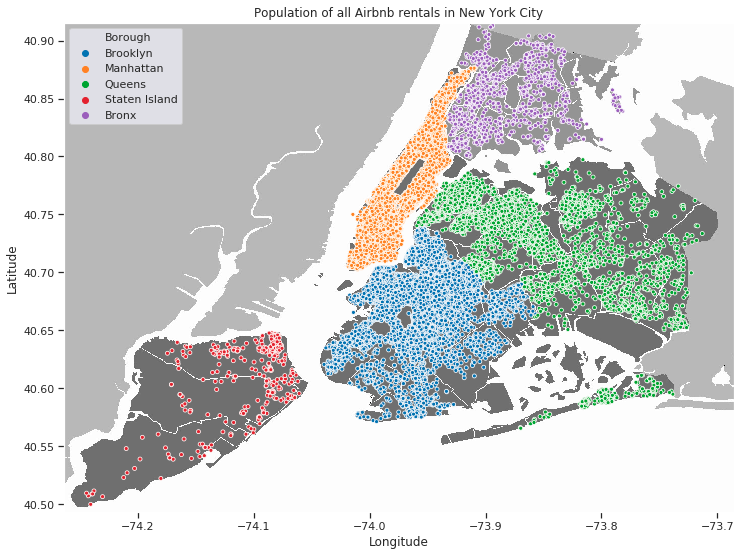
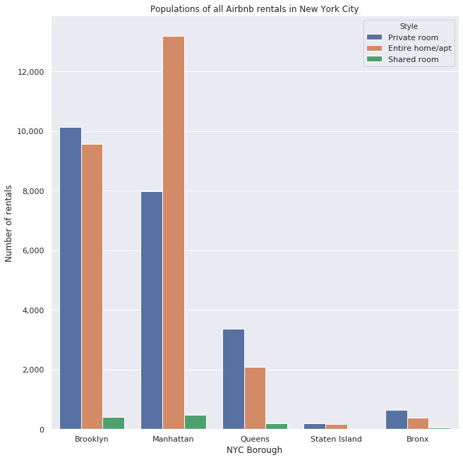
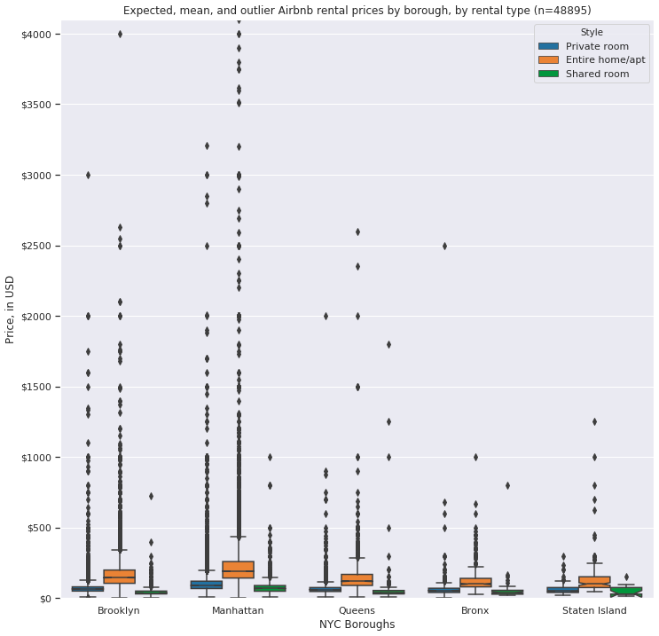
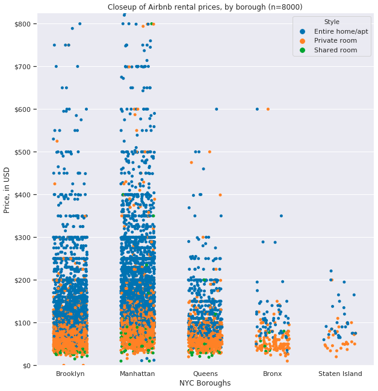
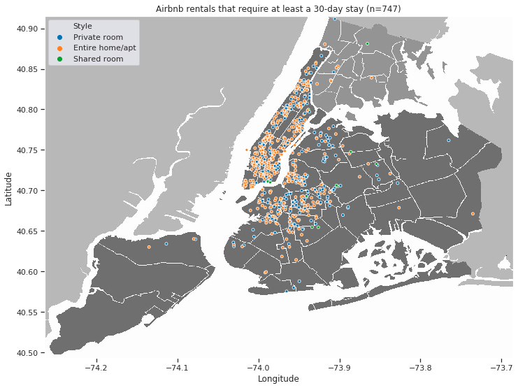

When I set out on the long journey that this project was, I was just a wee data sprout scientist. I found this relatively new and unused dataset, and I thought to myself, "_I miss this big city that I grew up around; wouldn't it be cool if..._" and not much more. I _wanted_ a bigger question -- perhaps something with more gravitas, or that could actually impact peoples' lives -- but that _wouldn't it be cool_ question just kept invading my thoughts. So, eventually, I followed that impulse, as all artists tend to do.  
I tried to make the best of it, expecting that my audience (or customers, clients, or whomever) would maybe, at best, gain a better understanding or picture of the Airbnb market in New York. I'll admit, it was a little didactic and so I struggled to invent a question that this dataset could answer. But follow me down this rabbit hole -- I doubt you'll be disappointed.

## Initial Analysis.

One of the very first interesting things I found was that the dataset had over 48,000 observations -- and that's in a city that only covers 302mi^2 (782km^2). That's over 158 Airbnb rental properties per mile^2 (or over 61 per km^2). If we look at that in map form, it looks a little something like this:

If we remove the map from underneath all those datapoints, we'd still be able to clearly define all five Boroughs of New York City. That's insane. Here's a look at those 48,000 Airbnb rentals and how they're divided up between each Borough:

I started to wonder, though. With over 48,000 possible places for someone to rent on any given day, surely many of these Airbnb rentals must be dirt cheap, right? Well, after a little exploration and data wrangling -- which, honestly, can feel like herding cats sometimes -- I had my answer...  
(and a fancy graph or two, too!)

## CODE SNIP price.min()

## CODE SNIP price.max()

You're probably thinking to yourself now, much like I was, "_Wait, there are Airbnb's available for $0 per night, and others for $10,000 per night???_" Like I said, this comes with some cool graphs, and this is kind of where it starts to get interesting:

You'll probably notice that I capped the graph at ~$4,000. I did this to preserve readability in the sub-$500 range, where _most_ of the data is -- if I left it uncapped, the boxes would have just been flat lines, because remember: someone, somewhere, is paying $10,000 per night to stay somewhere in Manhattan. You can even see this discrepancy in the graph as it is. All the black dots are considered data (or prices) that fall outside the normal or most common range for that Borough and rental style, and the higher you go the less and less common they get.

That's some good information to have for anyone thinking of maybe traveling to New York, but I wanted to go a little deeper, to get a closer look at this price data; surely there must be _something_ interesting there, right?

The first thing that jumped out at me when I was looking at the price data this way was that _whoa, 48,000 data points is just waaaay too much_, so I pared it down a bit by just taking a sample of 8,000 units -- any sample size much larger than that just turned Brooklyn, Manhattan, and Queens into solid colors, and that's just not helpful at all.  
But looking at the data this way, shows some interesting phenomena:  
	- First, a sort of stratification appears between the rental styles. At the very bottom, in the green, are the _Shared room_ listings; and the next category up, and a little more expensive, are the _Private room_ listings (orange); and then above those, and even more expensive, are the listings for _Entire homes/apts_. 
    - Second, there are also certain price intervals that Hosts in each Borough seem to gravitate towards or around, and they're not always the same from Borough to Borough.
    - Third, it seems those $0 per night rentals are in Brooklyn (are they _really_ free, though?), and people are willing to pay $800 per night for a _Shared room_ in Manhattan.

## I still wanted more, though.

Raw data like that wasn't enough. I went back to my dataset and eventually noticed some things that just didn't look right to me, like rentals that had a minimum stay of 30 days, or host IDs that were associated with more than 30 listings each. This was data that I had originally discarded, thinking it was extraneous, or unimportant, or that there just wasn't anything _interesting_ there.

## CODE SNIP df1['minimum_nights'] > 30

This is actually _really interesting_, however. There are over 700 listings in the city that require _at least_ a 30-day rental period. I couldn't help but ask why. "_This seems really strange, what law are they trying to get around?_" I thought to myself. Turns out, there's a statewide law in New York that prevents rentals of less than 30 days in multi-family buildings of any kind -- which means it's _these_ orange dots that are lawful units, _especially_ in Manhattan. How many single-family buildings do you know of in Manhattan? I am _definitely_ suspicous of the 40+ listings that ask for a 365-day minimum stay, though.

Likewise, I was also very suspicious of hosts that are listing more than 50 rentals _each_. Here's the top 10 host IDs, per properties listed:

## CODE SNIP df1[host_id'].value_counts()[:10]

I don't have an explanation for these guys (yet), except _maybe_ they're trying to skirt property management laws, regulations, or fees by listing through Airbnb. I feel like I'm reaching with that, but it could be interesting to investigate. Time, however, is a finite thing. 

Next time.

